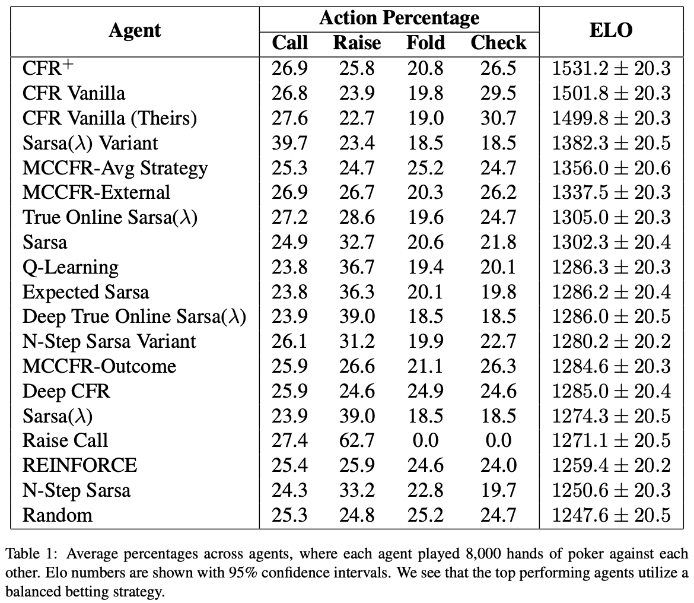
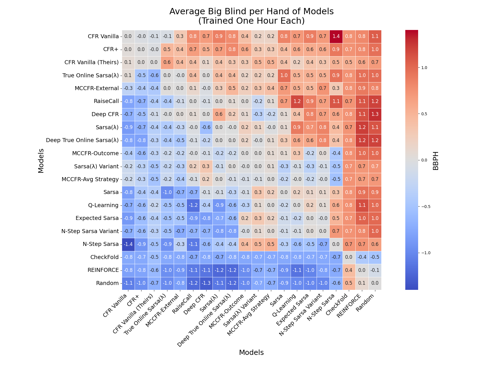
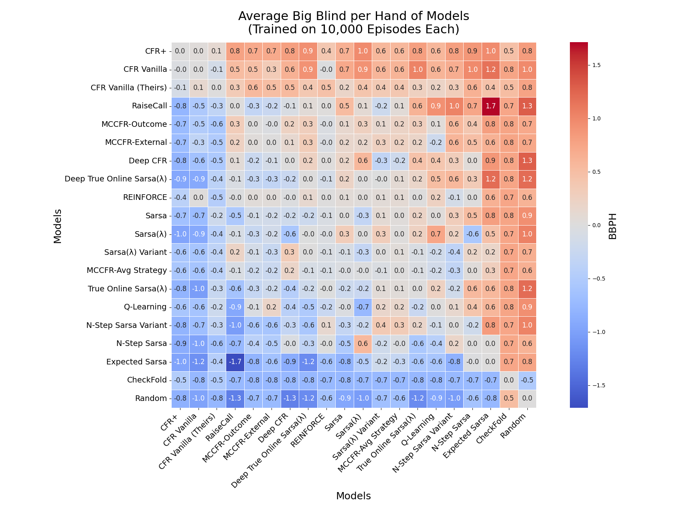

# Mastering Leduc Hold'em: A Comparative Study of CFR and Reinforcement Learning

This project is an extension of the work done by datamllab - RLCard library, focusing on a comparative study of Counterfactual Regret Minimization (CFR) and Reinforcement Learning (RL) algorithms for the game of Leduc Hold'em. We have implemented 18 different agents, including various CFR and RL agents, and compared their performance against each other.

## Our Contributions
### We have added the following agents to the RLCard library:

#### CFR Agents:
- CFR
- Monte Carlo CFR (Variants: Outcome Sampling, External Sampling, Average Sampling)
- CFR+
- Deep CFR

#### Naive Agents:
- Check Fold (Ultra-Passive)
- Raise Call (Ultra-Aggresive)

#### SARSA Agents:
- SARSA
- Expected Sarsa
- N-Step SARSA
- SARSA(λ)
- True Online SARSA(λ)
- Deep SARSA(λ)

#### Other Agents:
- Q-Learning
- REINFORCE

## Visualizations
Our study shows that CFR methods, particularly CFR+ and CFR Vanilla, outperform all other trained agents in the game of Leduc Hold'em. The top-performing agents utilize a balanced betting strategy, with folding being the least common action. Additionally, our top-performing bots demonstrate advanced strategies such as bluffing.

### Elo Ratings

This table shows the Elo rankings of all agents, along with their action percentages. CFR+ and CFR Vanilla outperform all other trained agents, and the top-performing bots employ a balanced betting strategy.

### BBPH Matrix (One Hour Training)

This matrix compares poker AI model performance in head-to-head play after one hour of training. Values show the net average big blinds won/lost per hand (BBPH) over 8,000 hands. Redder cells indicate the row model outperformed the column model

### BBPH Matrix (10,000 Episodes Training)

This matrix compares poker AI model performance in head-to-head play after training on 10,000 hands. Values show the net average big blinds won/lost per hand (BBPH) over 8,000 hands. Redder cells indicate the row model outperformed the column model.

### Training Curve

This plot shows the reward (measured by BBPH) at training checkpoints where the agent plays against a random agent over 1,000 hands. It is used to visualize learning instability rather than as a performance measure, as evaluating against a random agent is a weak indicator of agent performance.

All of our agent implementations can be found in the rlcard/agents/our_agents directory.

## Installation
Our installation follows the basic process outlined in the RLCard readme. Please follow the following process.

- Ensure that you have **Python 3.8+** and **pip** installed.
- git clone our repository

The following steps are
```
pip3 install rlcard
pip3 install -e .
```

### Training Agents
To train our agents on Leduc Hold'em, run the following command:
```
python examples/train_agents.py
```

### Evaluating Agents
To evaluate our agents and visualizae the comparative agent performance on the game of Leduc Hold'em, run the following command:

```
python examples/evaluate_agents.py
```

This will create a round-robin tournament where each agent plays against every other agent. The evaluation metrics include:

- Average Big Blind per Hand (BBPH)
- Elo rating of each agent 

To evaluate agents in a tournament, please see the instruction from datamllab - RLCard-showdown. Models can be loaded through the server-based GUI. As a fair warning, many of the package dependencies within RLCCard-showdown that interface with Django, Flash, and others will likely throw critical warnings. The server front end was still able to be launched and executed to review our bots and their performance.

### Acknowledgements

This project is built upon the RLCard library. We would like to express our gratitude to the RLCard team for their excellent work and for providing a platform for researching reinforcement learning in card games.
Please refer to the original [RLCard README](https://github.com/datamllab/rlcard/blob/master/README.md) or [RLCard-showdown README](https://github.com/datamllab/rlcard-showdown/blob/master/README.md) for more information on the library, including installation instructions, available environments, and supported algorithms.


## Application Programming Interface (API)
The API documents are available at [Official Website](http://www.rlcard.org).
